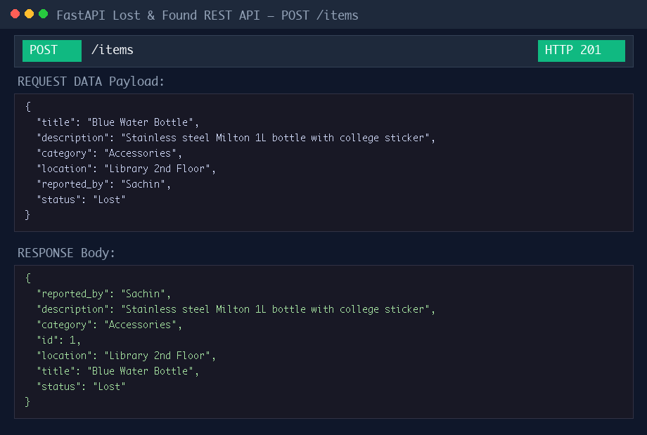
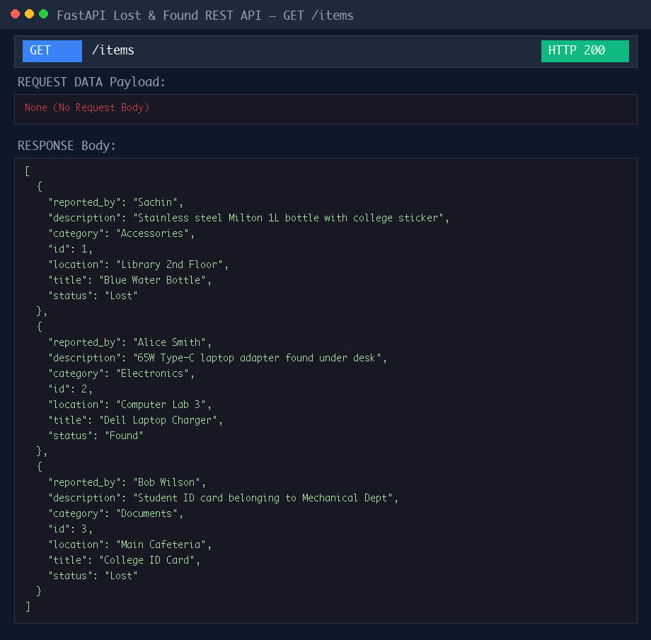
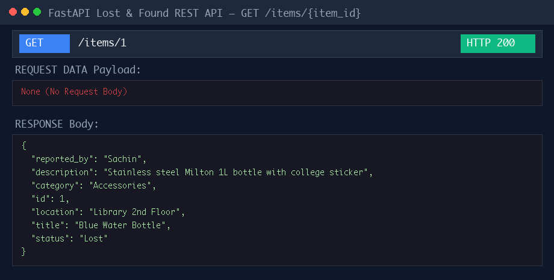
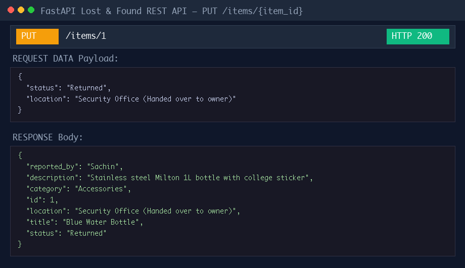
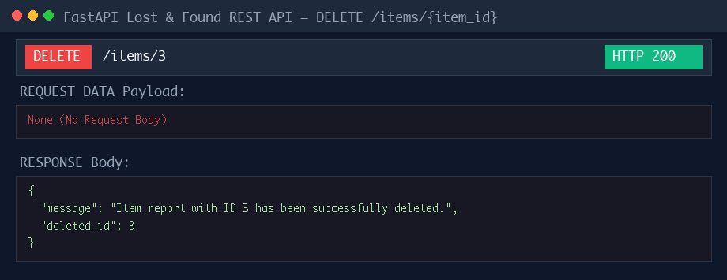
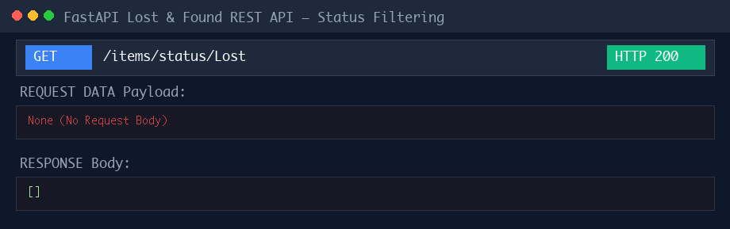
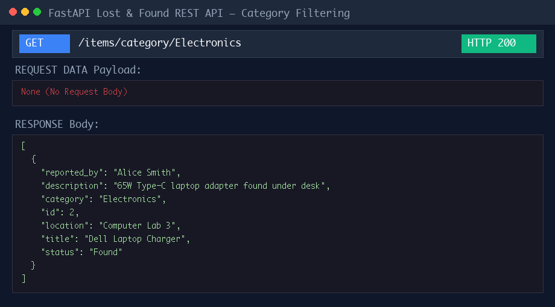
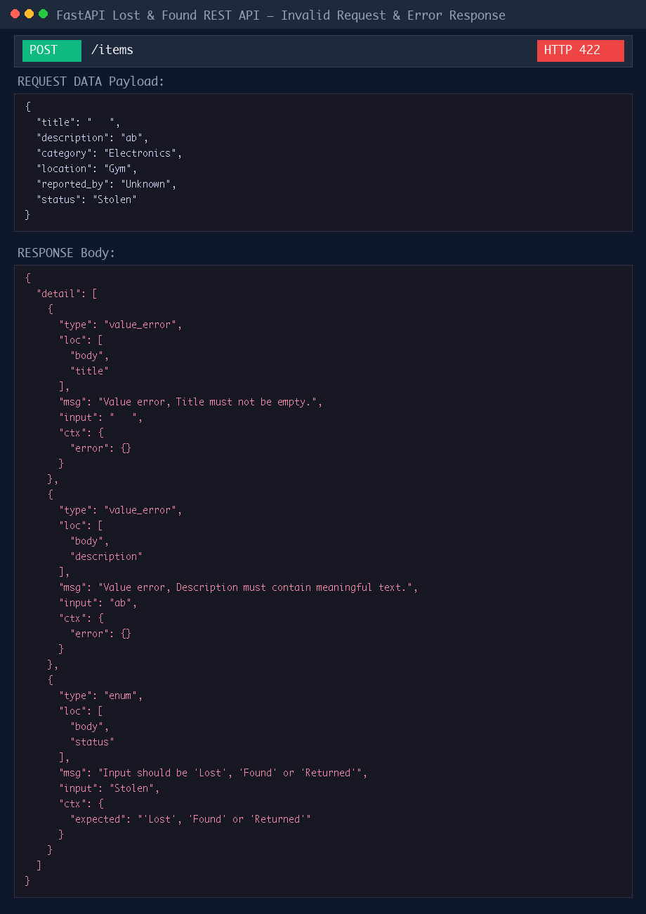

# College Lost & Found REST API

A FastAPI-based REST API built for a college campus to manage reported Lost, Found, and Returned items. Data is stored using **SQLModel** ORM with an **SQLite** database engine.

---

## Features & Requirements Fulfilling

- **Database Engine**: Uses SQLite (`lost_and_found.db`) initialized with SQLModel `create_engine()`. Tables are created automatically on application startup.
- **Item Data Model**: Includes `id`, `title`, `description`, `category`, `location`, `reported_by`, and `status`.
- **Validation Rules**:
  - `title` must not be empty or whitespace only.
  - `description` must contain meaningful text (minimum 3 non-whitespace characters).
  - `status` only accepts strictly allowed values: `Lost`, `Found`, or `Returned`.
  - Required fields are strictly validated by Pydantic / SQLModel schemas.
- **Error Handling**:
  - Non-existent item IDs return HTTP `404 Not Found`.
  - Invalid filter status inputs return HTTP `400 Bad Request`.
  - Schema validation failures return HTTP `422 Unprocessable Entity`.

---

## API Endpoint Reference

| Method | Endpoint | Description | Expected Status |
|---|---|---|---|
| `POST` | `/items` | Create a new lost/found item | `201 Created` |
| `GET` | `/items` | Return all reported items | `200 OK` |
| `GET` | `/items/{item_id}` | Return a specific item by ID | `200 OK` / `404 Not Found` |
| `PUT` | `/items/{item_id}` | Update details/status of an existing item | `200 OK` / `404 Not Found` |
| `DELETE` | `/items/{item_id}` | Delete an item report | `200 OK` / `404 Not Found` |
| `GET` | `/items/status/{status}` | Filter items by status (`Lost`, `Found`, `Returned`) | `200 OK` / `400 Bad Request` |
| `GET` | `/items/category/{category}` | Filter items by category (e.g. `Electronics`, `Accessories`) | `200 OK` |

---

## Project Structure

```
CrcTest/
├── database.py              # SQLite engine and session generator using SQLModel
├── models.py                # Item SQLModel definition, ItemStatus Enum, and Pydantic validators
├── main.py                  # FastAPI application and route endpoints
├── test_main.py             # Automated unit tests using unittest and TestClient
├── generate_screenshots.py  # Script to run API requests & render proof of work PNG screenshots
├── screenshots/             # Proof of Work screenshot images
│   ├── 01_post_items.png
│   ├── 02_get_items.png
│   ├── 03_get_item_by_id.png
│   ├── 04_put_item.png
│   ├── 05_delete_item.png
│   ├── 06_status_filtering.png
│   ├── 07_category_filtering.png
│   └── 08_invalid_request_validation_error.png
└── lost_and_found.db       # SQLite database file (created automatically on startup)
```

---

## Getting Started

### 1. Installation

Ensure Python 3.10+ is installed along with the required dependencies:

```bash
pip install fastapi uvicorn sqlmodel httpx pillow
```

### 2. Running the API Server

Start the server using `uvicorn`:

```bash
uvicorn main:app --reload
```

The interactive Swagger API documentation will be available at:
- **Swagger UI**: [http://127.0.0.1:8000/docs](http://127.0.0.1:8000/docs)
- **ReDoc**: [http://127.0.0.1:8000/redoc](http://127.0.0.1:8000/redoc)

### 3. Running Unit Tests

To run the automated unit test suite:

```bash
python3 test_main.py
```

### 4. Regenerating Proof of Work Screenshots

To execute live requests against the FastAPI app and regenerate visual proof-of-work screenshots:

```bash
python3 generate_screenshots.py
```

---

## Proof of Work Screenshots

### 1. Create Lost Item (`POST /items`)


### 2. List All Items (`GET /items`)


### 3. Fetch Specific Item (`GET /items/{item_id}`)


### 4. Update Item Details & Status (`PUT /items/{item_id}`)


### 5. Delete Item Report (`DELETE /items/{item_id}`)


### 6. Filter Items by Status (`GET /items/status/Lost`)


### 7. Filter Items by Category (`GET /items/category/Electronics`)


### 8. Invalid Request & Validation Error (`POST /items` with invalid data)

