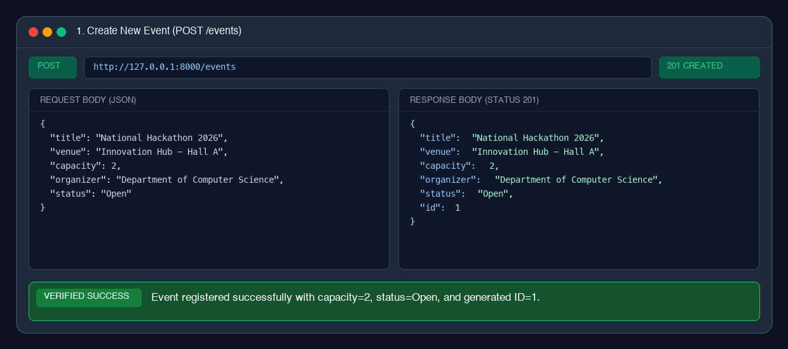
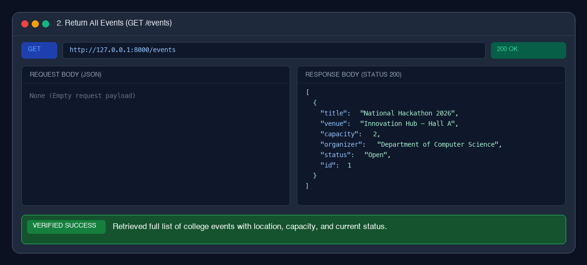
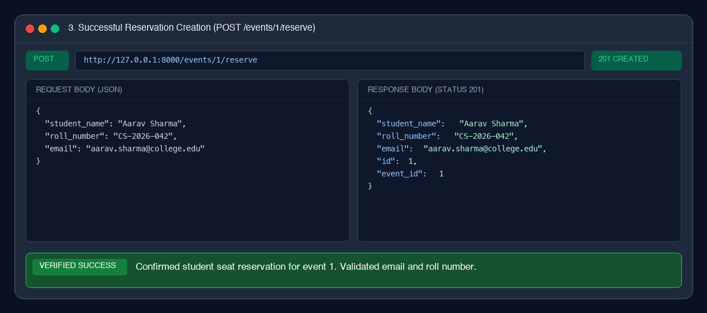
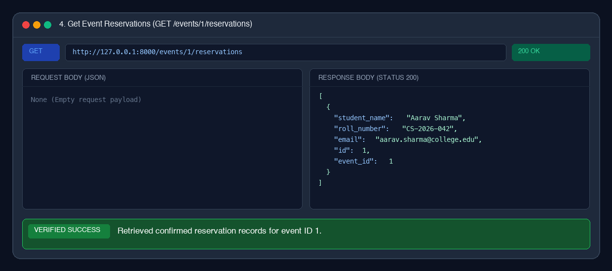
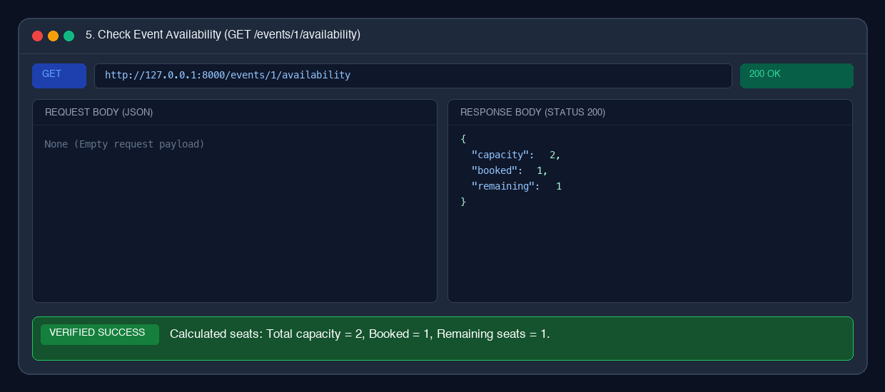
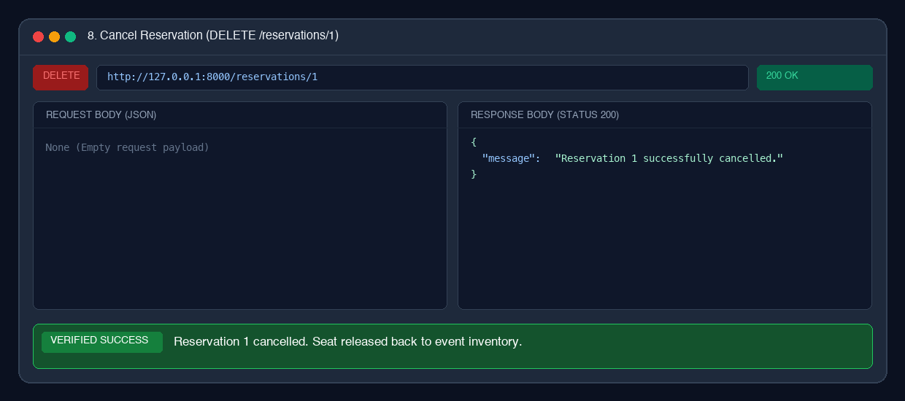
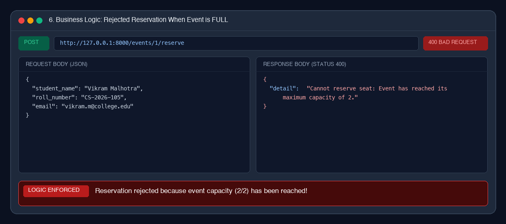
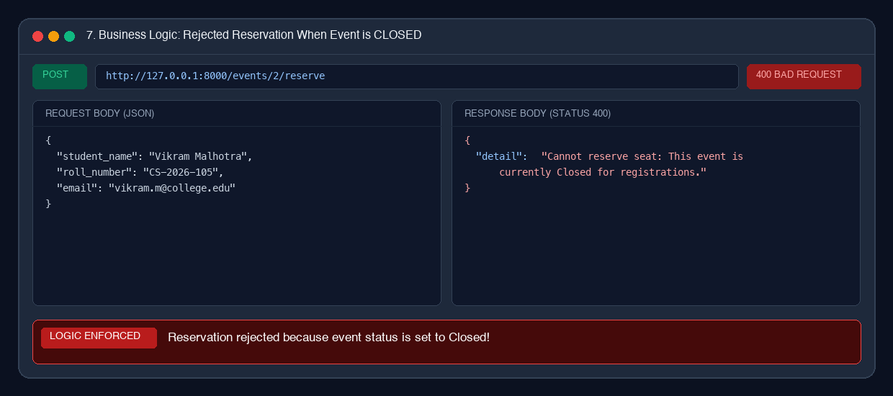

# 🎓 College Event & Student Reservation Management API

A high-performance, robust **FastAPI** RESTful API built with **SQLModel** and **SQLite** designed for colleges and universities to effortlessly manage technical events (workshops, hackathons, seminars, symposiums) and automate student seat reservations with real-time capacity and availability tracking.

---

## 📌 1. Project Description

Colleges frequently organize workshops, hackathons, seminars, and technical conclaves. Traditionally, students register manually or via unstructured spreadsheets, making it error-prone and tedious for organizers to track available seats in real-time. This frequently causes overbooking, unorganized attendee lists, and lack of visibility into seat availability.

This project delivers a production-ready REST API solution that:
- **Centralizes Event Management:** Allows organizers to create, view, update, and manage events with venue, total capacity, organizer information, and registration status (`Open` or `Closed`).
- **Automates Reservations:** Enables students to register for events while enforcing strict business rules (validating emails, checking open status, and preventing duplicate registrations).
- **Guarantees Zero Overbooking:** Automatically locks registrations as soon as an event reaches its defined capacity, returning clear HTTP 400 errors.
- **Tracks Real-Time Availability:** Provides an instant breakdown of total capacity, booked seats, and remaining seats for any event.
- **Cascades Cancellations:** Enables students to cancel reservations, immediately replenishing available seats. Deleting an event safely cleans up associated reservations.

---

## 💻 2. Technologies Used

| Technology | Purpose |
|---|---|
| **Python 3.10+** (tested on 3.14) | Core programming language |
| **FastAPI** | High-performance modern web framework for building APIs with automatic OpenAPI docs |
| **SQLModel** | Next-generation ORM seamlessly combining **SQLAlchemy** power with **Pydantic** validation |
| **SQLite** | Lightweight, zero-configuration relational database engine (`events.db`) |
| **Uvicorn** | Lightning-fast ASGI production web server |
| **Pydantic v2 & email-validator** | Strong data validation, data parsing, and strict email format verification |
| **unittest / pytest** | Automated test suite verifying 100% of endpoints, constraints, and business logic |

---

## 🚀 3. Installation Steps

### Prerequisites
- Python 3.10 or higher installed on your system.
- Git (optional, for version control).

### Step-by-Step Setup

1. **Clone or Navigate to the Repository:**
   ```bash
   cd Proejct2
   ```

2. **Create and Activate a Virtual Environment (Recommended):**
   - On macOS/Linux:
     ```bash
     python3 -m venv venv
     source venv/bin/activate
     ```
   - On Windows:
     ```powershell
     python -m venv venv
     venv\Scripts\activate
     ```

3. **Install Dependencies:**
   ```bash
   pip install -r requirements.txt
   ```

The SQLite database tables are **automatically created** upon starting the application via FastAPI's `lifespan` handler. No manual SQL migrations or database setup scripts are required!

---

## ⚡ 4. Command to Run the FastAPI Application

Start the server using **Uvicorn**:

```bash
uvicorn app.main:app --reload --host 0.0.0.0 --port 8000
```

Alternatively, you can also run:
```bash
python main.py
```
or
```bash
uvicorn main:app --reload
```

The application will start and log:
```
INFO:     Started server process
INFO:     Waiting for application startup.
INFO:     Application startup complete.
INFO:     Uvicorn running on http://0.0.0.0:8000 (Press CTRL+C to quit)
```

---

## 🌐 5. Swagger UI URL

FastAPI automatically serves interactive, human-friendly API documentation:

- **Swagger UI (Interactive API Explorer & Testing):**  
  👉 **[http://127.0.0.1:8000/docs](http://127.0.0.1:8000/docs)**

- **ReDoc (Alternative OpenAPI Documentation):**  
  👉 **[http://127.0.0.1:8000/redoc](http://127.0.0.1:8000/redoc)**

- **Root / Health Check Endpoint:**  
  👉 **[http://127.0.0.1:8000/](http://127.0.0.1:8000/)**

---

## 📡 6. Brief Description of Available Endpoints

### Summary Table

| Method | Endpoint | Description | Status Code |
|---|---|---|---|
| `POST` | `/events` | Create a new college event | `201 Created` |
| `GET` | `/events` | Return all registered events | `200 OK` |
| `GET` | `/events/{event_id}` | Return details for a specific event | `200 OK` / `404 Not Found` |
| `PUT` | `/events/{event_id}` | Update event details (title, venue, capacity, status) | `200 OK` / `404 Not Found` |
| `DELETE` | `/events/{event_id}` | Delete an event and all its reservations | `200 OK` / `404 Not Found` |
| `POST` | `/events/{event_id}/reserve` | Reserve a student seat in an event | `201 Created` / `400 Bad Request` |
| `GET` | `/events/{event_id}/reservations` | Return all student reservations for an event | `200 OK` / `404 Not Found` |
| `DELETE` | `/reservations/{reservation_id}` | Cancel a student reservation | `200 OK` / `404 Not Found` |
| `GET` | `/events/{event_id}/availability` | Return total capacity, booked seats, and remaining seats | `200 OK` / `404 Not Found` |

---

### Detailed Endpoint Descriptions & Examples

#### 1. `POST /events`
Creates a new event.
- **Request Body:**
  ```json
  {
    "title": "National Hackathon 2026",
    "venue": "Innovation Hub - Hall A",
    "capacity": 50,
    "organizer": "Department of Computer Science",
    "status": "Open"
  }
  ```
- **Response (`201 Created`):**
  ```json
  {
    "id": 1,
    "title": "National Hackathon 2026",
    "venue": "Innovation Hub - Hall A",
    "capacity": 50,
    "organizer": "Department of Computer Science",
    "status": "Open"
  }
  ```

#### 2. `GET /events`
Returns all events registered in the system.
- **Response (`200 OK`):**
  ```json
  [
    {
      "id": 1,
      "title": "National Hackathon 2026",
      "venue": "Innovation Hub - Hall A",
      "capacity": 50,
      "organizer": "Department of Computer Science",
      "status": "Open"
    }
  ]
  ```

#### 3. `GET /events/{event_id}`
Returns details of a specific event. Returns `404 Not Found` if the event does not exist.

#### 4. `PUT /events/{event_id}`
Updates editable event fields (`title`, `venue`, `capacity`, `organizer`, `status`).  
*Validation:* Rejects reducing capacity below the number of currently confirmed student reservations with `400 Bad Request`.

#### 5. `DELETE /events/{event_id}`
Deletes the event and automatically cascades to delete all associated student reservations.

#### 6. `POST /events/{event_id}/reserve`
Reserves a seat for a student for the specified event.
- **Validation & Business Logic:**
  1. Verifies that the event exists (returns `404 Not Found` if not).
  2. Verifies that the event status is `Open` (returns `400 Bad Request` if `Closed`).
  3. Checks existing reservations against event capacity (returns `400 Bad Request` if full).
  4. Validates that the student's email is a valid email address and fields are non-empty.
  5. Prevents duplicate reservations by the same student (same roll number or email) for the same event.
- **Request Body:**
  ```json
  {
    "student_name": "Aarav Sharma",
    "roll_number": "CS-2026-042",
    "email": "aarav.sharma@college.edu"
  }
  ```
- **Response (`201 Created`):**
  ```json
  {
    "id": 1,
    "event_id": 1,
    "student_name": "Aarav Sharma",
    "roll_number": "CS-2026-042",
    "email": "aarav.sharma@college.edu"
  }
  ```

#### 7. `GET /events/{event_id}/reservations`
Returns a list of all student reservations confirmed for a specific event.

#### 8. `DELETE /reservations/{reservation_id}`
Cancels a reservation by its ID and releases the seat back to the event inventory. Returns `404 Not Found` if the reservation ID does not exist.

#### 9. `GET /events/{event_id}/availability`
Calculates and returns seat counts for the event.
- **Response (`200 OK`):**
  ```json
  {
    "capacity": 50,
    "booked": 32,
    "remaining": 18
  }
  ```

---

## 🧪 7. Automated Testing

The project includes an automated test suite verifying all 9 endpoints, validation checks, and capacity edge cases.

To execute the tests:
```bash
python3 -m unittest -v tests/test_api.py
```
*(or `pytest -v tests/test_api.py` if pytest is installed)*

**Test Coverage Summary:**
- ✅ `test_create_event_success`: Event creation with valid payload
- ✅ `test_create_event_invalid_capacity`: Rejection when capacity $\le 0$
- ✅ `test_create_event_empty_fields`: Rejection when strings contain whitespace only
- ✅ `test_list_events`: Fetching all events
- ✅ `test_get_event_by_id`: Fetching event and 404 handling
- ✅ `test_update_event`: Updating details and status transitions
- ✅ `test_delete_event`: Event deletion and reservation cascading
- ✅ `test_reserve_seat_success`: Successful student reservation
- ✅ `test_reserve_seat_invalid_email`: Rejection of malformed email addresses
- ✅ `test_reserve_seat_empty_student_name`: Rejection of blank student names
- ✅ `test_reserve_seat_non_existent_event`: 404 response on invalid event ID
- ✅ `test_reserve_seat_closed_event`: Rejection when event status is `Closed`
- ✅ `test_reserve_seat_capacity_limit`: Strict capacity limit enforcement (400 full)
- ✅ `test_reserve_seat_duplicate_prevention`: Rejection of duplicate student booking
- ✅ `test_event_availability`: Seat calculation (`capacity`, `booked`, `remaining`)
- ✅ `test_list_event_reservations`: Listing all reservations for an event
- ✅ `test_cancel_reservation`: Deletion of reservation and restoration of available seats

---

## 📸 8. Proof of Work Screenshots

All verification screenshots demonstrating working business logic and API responses are stored in the [`screenshots/`](./screenshots) directory.

### 1. `POST /events` — Create New Event


### 2. `GET /events` — Return All Events


### 3. `POST /events/{event_id}/reserve` — Successful Reservation Creation


### 4. `GET /events/{event_id}/reservations` — GET Event Reservations


### 5. `GET /events/{event_id}/availability` — Event Availability (Capacity, Booked, Remaining)


### 6. `DELETE /reservations/{reservation_id}` — Successful Reservation Cancellation


### 7. Rejected Reservation When Event is FULL (Capacity Constraint Enforced)


### 8. Rejected Reservation When Event is CLOSED (Status Constraint Enforced)


---

## 📂 9. Repository Structure

```
Proejct2/
├── app/
│   ├── __init__.py
│   ├── database.py              # SQLite engine, table creation, session dependency
│   ├── models.py                # SQLModel Event & Reservation models + Schemas
│   ├── main.py                  # FastAPI app initialization, lifespan, CORS, routers
│   └── routers/
│       ├── __init__.py
│       ├── events.py            # Event CRUD, availability, & reserve endpoints
│       └── reservations.py      # Reservation cancellation endpoint
├── tests/
│   ├── __init__.py
│   └── test_api.py              # 18 automated unit & integration tests
├── scripts/
│   └── generate_screenshots.py  # Script for generating proof-of-work captures
├── screenshots/
│   ├── 01_post_event.png
│   ├── 02_get_events.png
│   ├── 03_successful_reservation.png
│   ├── 04_get_reservations.png
│   ├── 05_event_availability.png
│   ├── 06_reservation_cancellation.png
│   ├── 07_rejected_reservation_full.png
│   └── 08_rejected_reservation_closed.png
├── main.py                      # Root convenience runner
├── requirements.txt             # Project dependencies
└── README.md                    # Complete project documentation
```
